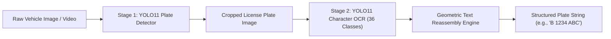
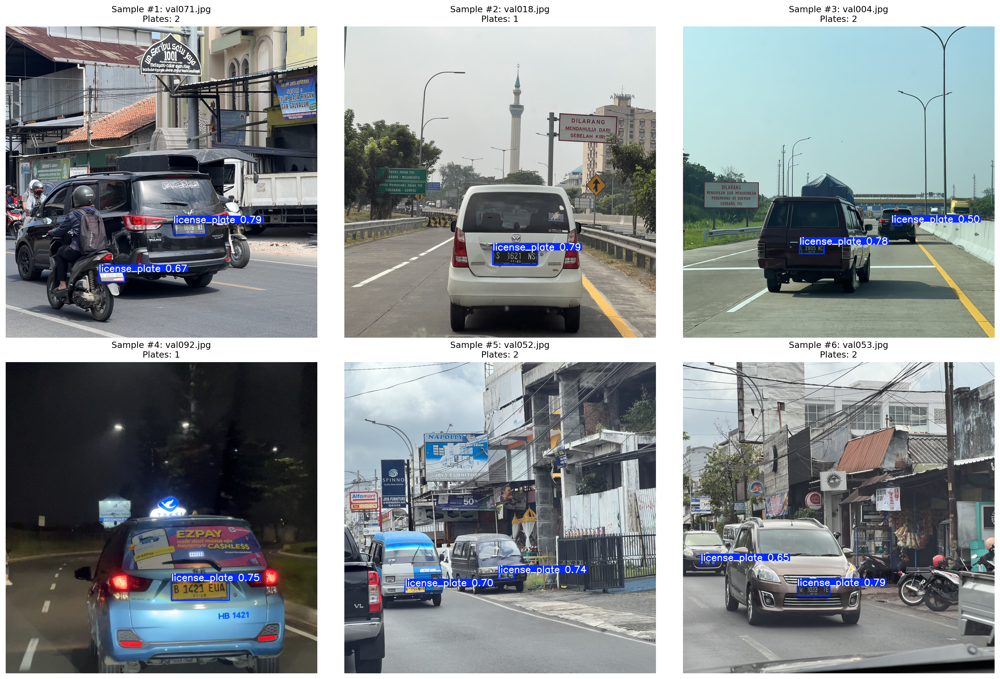
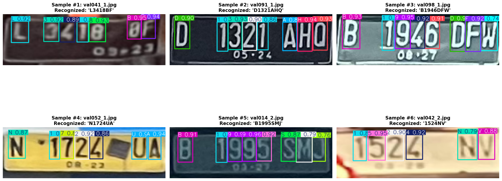
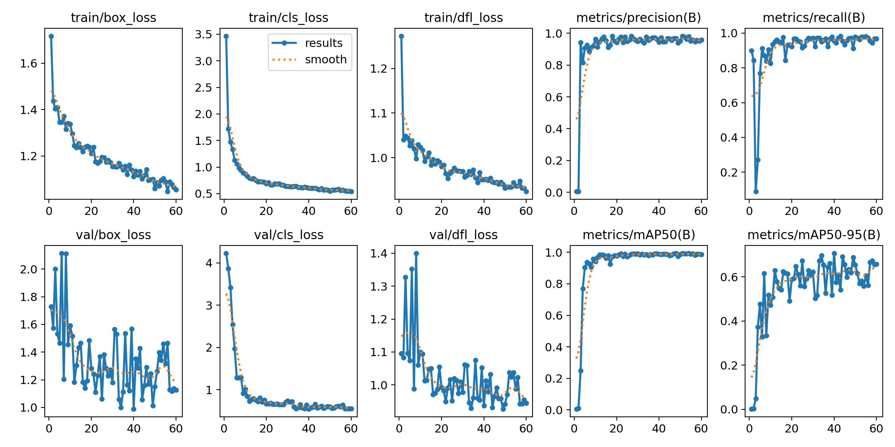
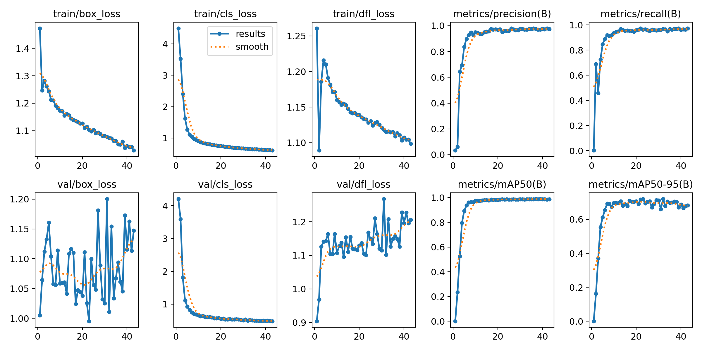
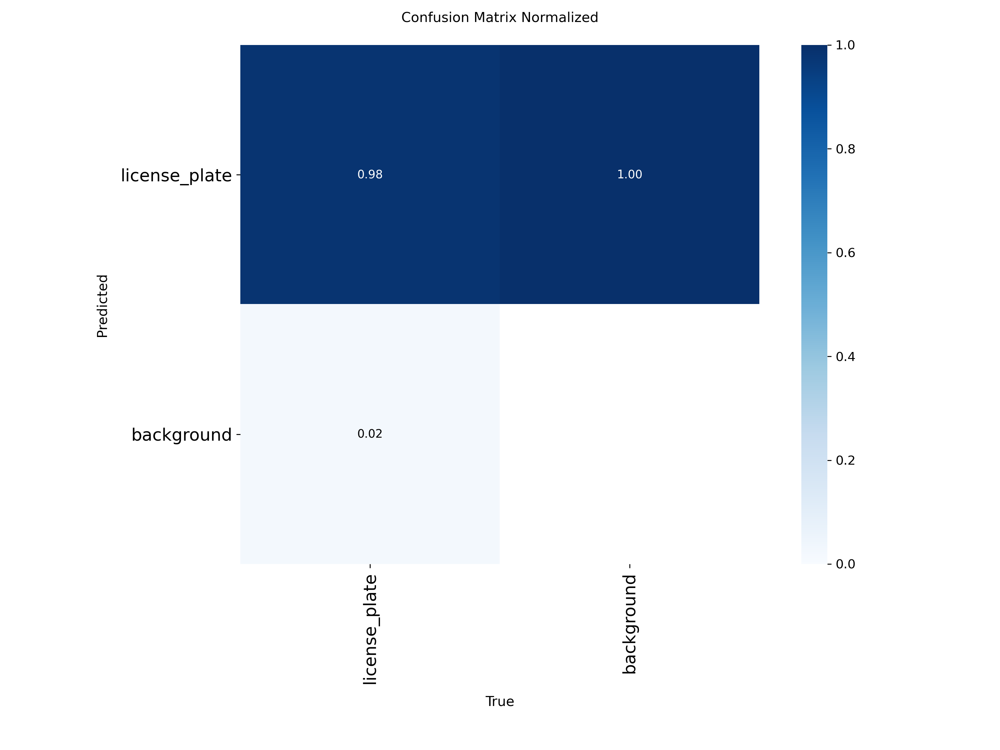
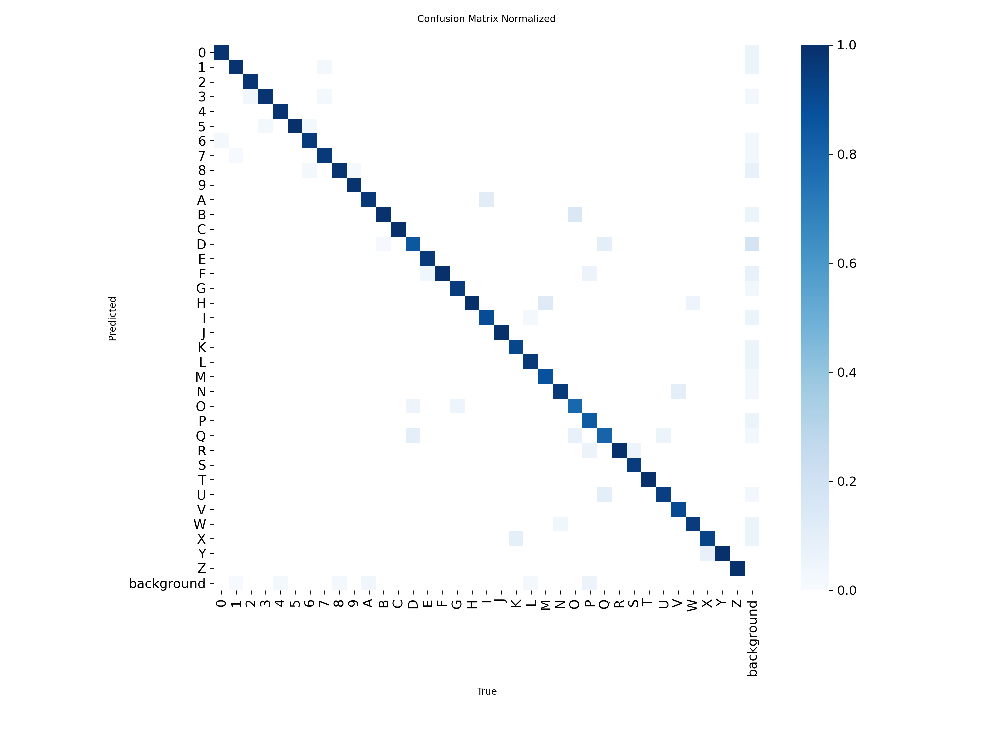

# Indonesian Automatic License Plate Recognition (ALPR) with YOLO11

[](https://colab.research.google.com)
[](https://huggingface.co)
[](https://huggingface.co/spaces)
[](https://docs.ultralytics.com)
[](LICENSE)

An end-to-end, two-stage deep learning pipeline engineered for real-time Indonesian Vehicle License Plate Detection and Character Recognition (ALPR / ANPR) using **Ultralytics YOLO11**.

---

## 🚀 Architecture Overview

The system operates as a modular two-stage pipeline:



1. **Stage 1 — Vehicle License Plate Detection (`plate_detection.ipynb`)**:
   - Detects vehicle license plate bounding boxes in diverse environments (harsh sunlight, rain, angle tilt, low-light).
   - Achieves **98.84% mAP@0.5** with single-digit millisecond latency.
2. **Stage 2 — Character Recognition & OCR (`plate_recognizer.ipynb`)**:
   - Classifies 36 alphanumeric character classes (`0-9`, `A-Z`).
   - Achieves **98.40% mAP@0.5** and reconstructs characters into standardized license plate strings.
3. **Multi-Format Edge Deployment**:
   - **PyTorch (`.pt`)** for GPU server batch processing.
   - **ONNX (`.onnx`)** for cross-platform desktop/backend runtimes.
   - **TFLite INT8 / FP16 (`.tflite`)** with dataset calibration for mobile (Android/iOS) and edge devices (Raspberry Pi, Jetson Nano).

---

## 📊 Benchmark & Performance Metrics

Evaluated on the official validation splits of the Indonesian License Plate Dataset:

| Model / Stage | Task | Precision | Recall | mAP@0.5 | mAP@0.5:0.95 | Inference Latency (GPU) | Throughput |
| :--- | :--- | :---: | :---: | :---: | :---: | :---: | :---: |
| **Stage 1: Plate Detector** (`yolo11n`) | Bounding Box Detection | **94.13%** | **95.53%** | **98.84%** | **70.86%** | **6.91 ms** | ~145 FPS |
| **Stage 2: Character OCR** (`yolo11n`) | 36-Class Alphanumeric OCR | **96.24%** | **96.34%** | **98.40%** | **72.01%** | **2.41 ms** | ~415 FPS |
| **End-to-End Pipeline** | Full 2-Stage ALPR | — | — | — | — | **~9.32 ms** | **~107 FPS** |

---

## 🖼️ Qualitative Results & Visual Showcases

### 1. License Plate Detection Showcase


### 2. Character Recognition & Text Assembly Showcase


### 3. Training Loss Curves & Normalized Confusion Matrices
| Stage 1: Plate Detection Curves | Stage 2: Character Recognition Curves |
| :---: | :---: |
|  |  |
|  |  |

---

## 📂 Repository Structure

```
├── plate_detection.ipynb            # Stage 1: Plate Detection Training & Export
├── plate_recognizer.ipynb           # Stage 2: Character OCR Training & Export
├── pipeline.py                      # 2-Stage Python Inference Pipeline & CLI
├── app.py                           # Gradio Web Demo (Hugging Face Spaces)
├── requirements.txt                 # Project Dependencies
├── weights/                         # Pretrained PyTorch (.pt) and ONNX (.onnx) weights
│   ├── plate_detector_yolo11n.pt
│   ├── plate_detector_yolo11n.onnx
│   ├── plate_recognizer_yolo11n.pt
│   └── plate_recognizer_yolo11n.onnx
├── assets/                          # Showcase figures & benchmark plots
├── model_cards/                     # Hugging Face Model Card manifests
│   ├── detector_README.md
│   └── recognizer_README.md
└── reports/                         # Detailed metrics & training logs
```

---

## 🛠️ Quickstart & Usage

### 1. Installation
```bash
git clone https://github.com/your-username/indonesian-plate-alpr.git
cd indonesian-plate-alpr
pip install -r requirements.txt
```

### 2. Python API
```python
from pipeline import IndonesianALPR

# Initialize the 2-stage ALPR pipeline
alpr = IndonesianALPR(
    detector_weights="weights/plate_detector_yolo11n.pt",
    recognizer_weights="weights/plate_recognizer_yolo11n.pt",
    det_conf=0.35,
    rec_conf=0.35
)

# Run end-to-end prediction
results = alpr.predict("sample_vehicle.jpg")

for idx, plate in enumerate(results, 1):
    print(f"Plate #{idx}: {plate['recognized_text']} (Confidence: {plate['detector_confidence'] * 100:.1f}%)")

# Draw visual bounding box and text overlays
annotated_img = alpr.annotate_image("sample_vehicle.jpg", results)
```

### 3. CLI Command
```bash
python pipeline.py --image sample_vehicle.jpg --output result_annotated.jpg
```

### 4. Interactive Web UI (Gradio / Hugging Face Space)
```bash
python app.py
```

---

## 📊 Dataset & Credits
- Dataset: **Juan Thomas Wijaya**: [Indonesian License Plate Dataset](https://www.kaggle.com/datasets/juanthomaswijaya/indonesian-license-plate-dataset) on Kaggle.
- Deep Learning Framework: [Ultralytics YOLO11](https://github.com/ultralytics/ultralytics).
